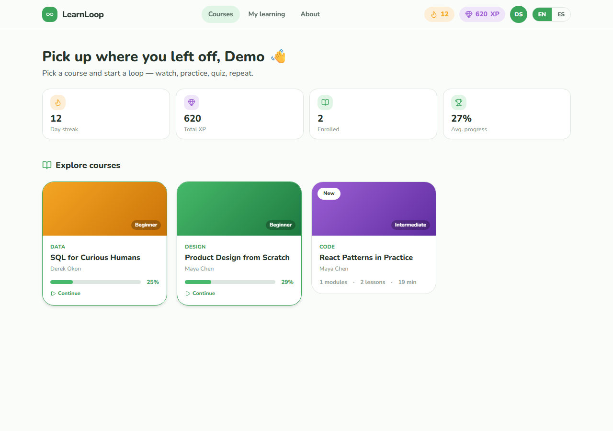
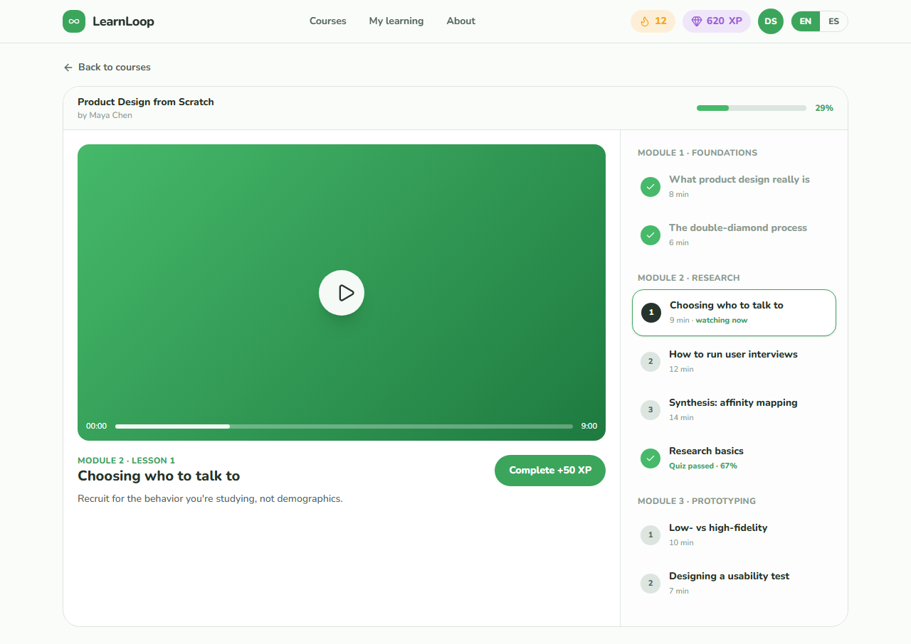
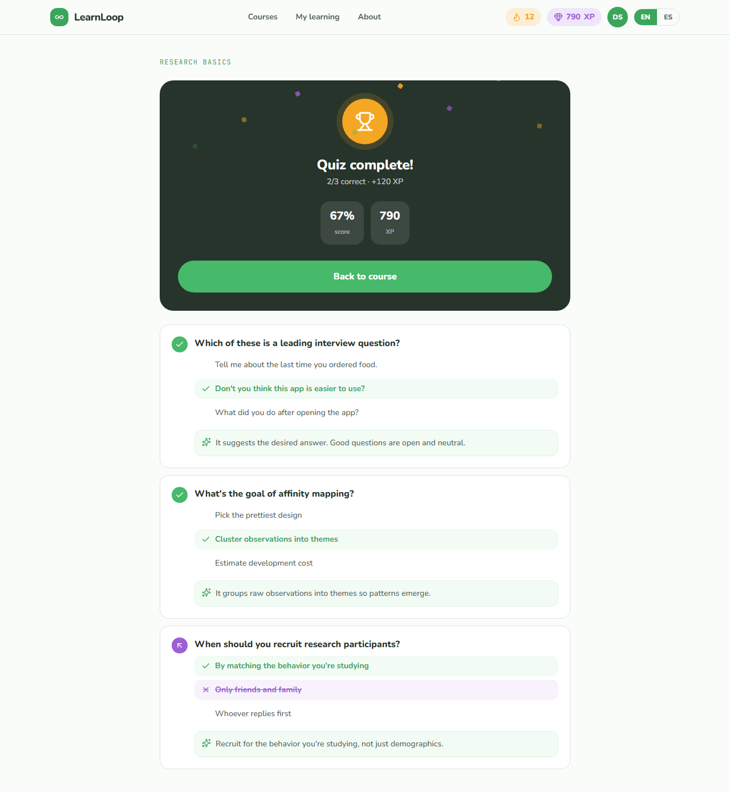
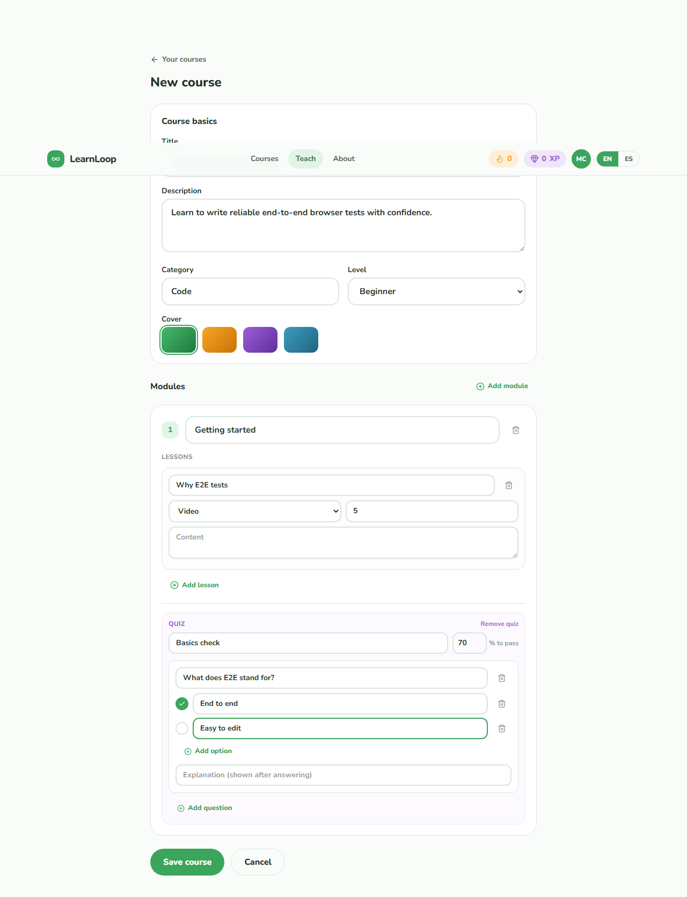
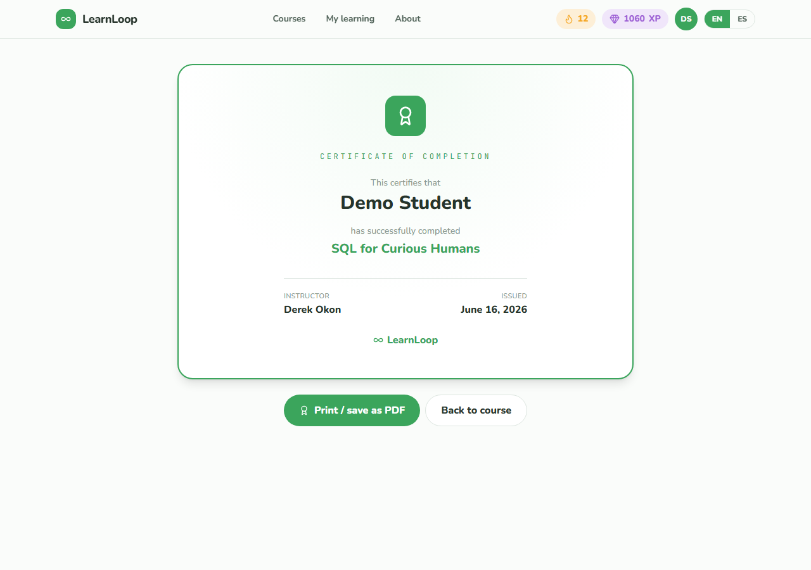
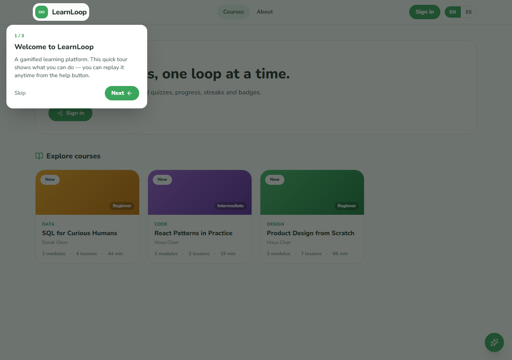

# LearnLoop ∞

An online **learning platform (LMS)** with gamification: instructors author courses (modules → lessons → quizzes); students enroll, track progress, take auto-graded quizzes, earn XP/streaks/badges, and get a certificate on completion.

Part of [Luis Chiquito Vera's portfolio](https://luisgxz.github.io/portfolio/). Built to showcase **Java / Spring Boot**. Bilingual EN/ES.

| | |
|---|---|
| **Live demo** | _pending deploy_ (GitHub Pages + Azure) |
| **Demo accounts** | `instructor@learnloop.dev` · `student@learnloop.dev` — password `Demo1234!` |

## Screens

| Catalog | Lesson view | Quiz result |
|---|---|---|
|  |  |  |

| Course builder | Certificate | Guided tour |
|---|---|---|
|  |  |  |

## Stack

| Layer | Tech |
|-------|------|
| Frontend | Angular 20 (standalone, signals) · Tailwind v4 · TypeScript (strict) |
| Backend | Spring Boot 3.5 (Java 21) · Spring Security · JPA/Hibernate · Bean Validation |
| Database | MySQL 8 |
| Auth | JWT (jjwt, HS384) · bcrypt · roles INSTRUCTOR / STUDENT · `@PreAuthorize` |
| Deploy | GitHub Pages (web) · Azure App Service F1 Java (API) · managed MySQL (free) |

## Highlights

- **Clean layered backend** — controller → service → repository; entities never leave the service layer (DTO records only).
- **Real RBAC** — stateless JWT, method security, ownership checks (instructors edit only their own courses; students see only their own progress).
- **RFC-7807 errors** — `@RestControllerAdvice` returns ProblemDetail with a per-field map the UI renders inline.
- **Gamification** — XP per lesson/quiz, day streaks, badges, and a printable certificate at 100%. Quizzes are graded server-side and never expose correct answers to the client.
- **Polished frontend** — lazy routes, OnPush + signals, hand-rolled EN/ES i18n, loading/empty/error states, considered animations (progress bars, floating +XP, confetti) that respect `prefers-reduced-motion`, and a role-aware guided-demo tour.

## Run locally

```bash
# MySQL (Docker)
docker run -d --name learnloop-mysql -p 3306:3306 -e MYSQL_ROOT_PASSWORD=root -e MYSQL_DATABASE=learnloop mysql:8

# Backend  → http://localhost:8080  (seeds demo data on first run)
cd backend && ./mvnw spring-boot:run

# Frontend → http://localhost:4200
npm start --prefix frontend
```

## Tests

```bash
cd backend && ./mvnw test     # JwtService + author→enroll→complete→quiz-ace flow (H2)
cd frontend && npm run e2e    # Playwright: browse, tour, learning, quiz, course CRUD
```

The E2E suite fails on **any** `console.error`/`pageerror`. Responsive verified at 390 / 768 / 1280 (`npm run shots`).

## Docs

- [`docs/TECHNICAL.md`](docs/TECHNICAL.md) — architecture deep-dive.
- [`docs/PHASES.md`](docs/PHASES.md) — build log.
- [`docs/DEPLOY.md`](docs/DEPLOY.md) — deployment steps.
